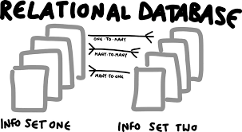

# Database Design - *A hands-on approach*
 

 
## Why to learn about databases in 2023?

Learning database design is a timeless and valuable skill that continues to be relevant in 2023. Database design is an integral part of the overall system architecture. Mastering this skill provides a more holistic understanding of how applications and systems function, enabling developers and data professionals to make informed decisions about the design and optimization of the entire system.

## Who Should Take This Course?

Whether you want to be a software developer or interested in any data related roles like data analyst, PowerBI professional or data scientest, an in-dept understanding of database technology will be crucial to your success. 

## How this course will be conducted?

This course will take a hands-on approach. The course topics are divided into 4 key areas:

	- Week 1 & 2: Understand database concepts and develop SQL coding Skills
	- Week 3 & 4: Understand data modeling techniqes and design logical/physical database design
	- Week 5 & 6: Understand OLTP system design practices and build a transactional database model
	- Week 7 & 8: Understand OLAP system design practices and build a analytical database model

## What topics will this course cover?

To be more specific, this course will cover the following topics:

	- develop understanding of database technology
	- perform Create-Read-Update-Delete (CRUD) operations using Structured Query Language (SQL)
 	- learn components of SQL
  		- Data Definiation Language (DDL)
    		- Data Maniputation Language (DML)
      		- Data Control Language (DCL)
	- learn entity-relationship modeling technique (ER-model)
   	- develop understanding of database objects like table, view, sequence, synonym, materialized views, indexes
        - develop understanding of database stored procedures, functions, triggers
  	- differentiate between a OLTP and OLAP systems
  	- learn transactional system design techniques 
   	- learn analytical system design techniques

## What tools and databases will be used in this course?

Database management systems used in this course will include [SQLITE](https://www.sqlite.org/index.html), [PostgreSQL](https://www.postgresql.org/) and [DuckDB](https://duckdb.org/). For writing SQL queries, an integrated development environment (IDE) that supports course databases used in this course will be useful. 
 

